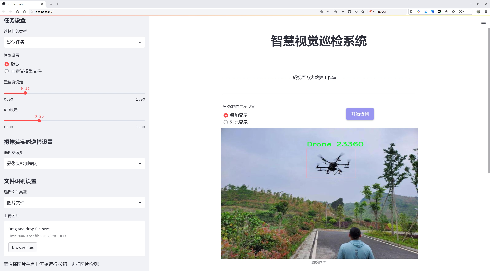
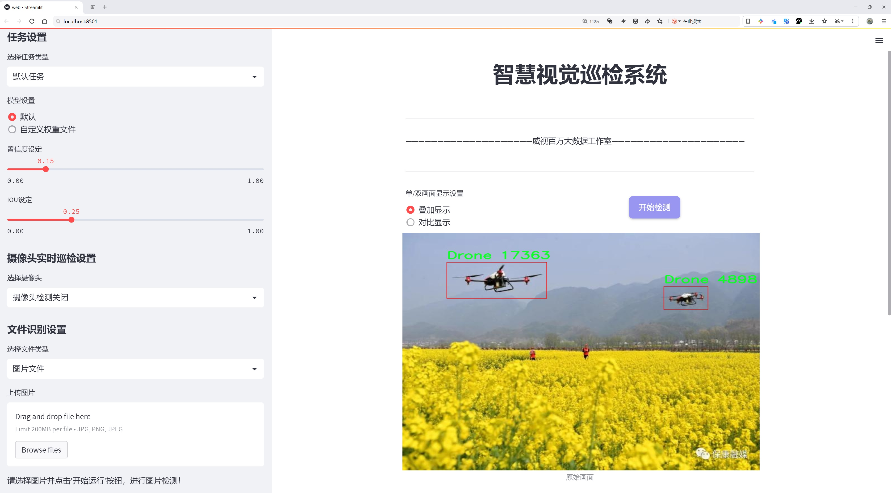
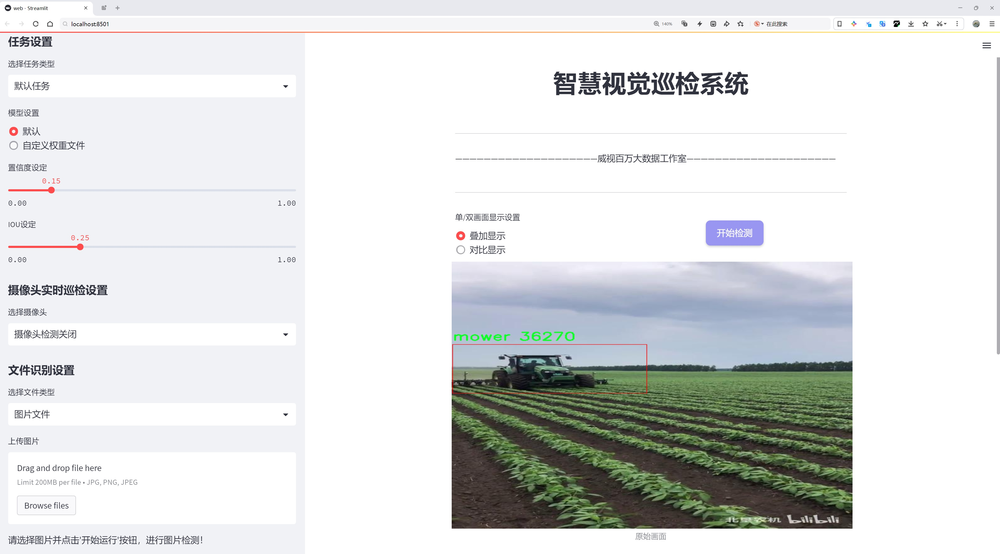
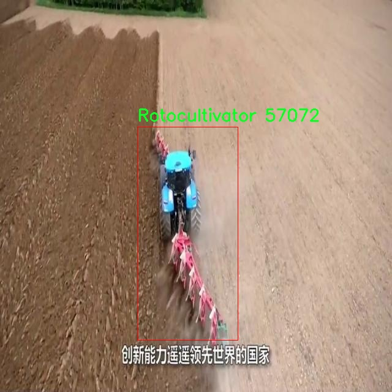
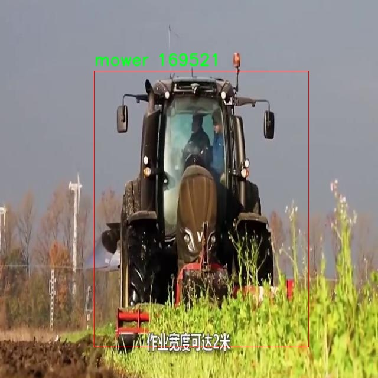
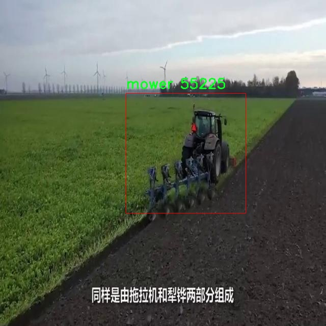
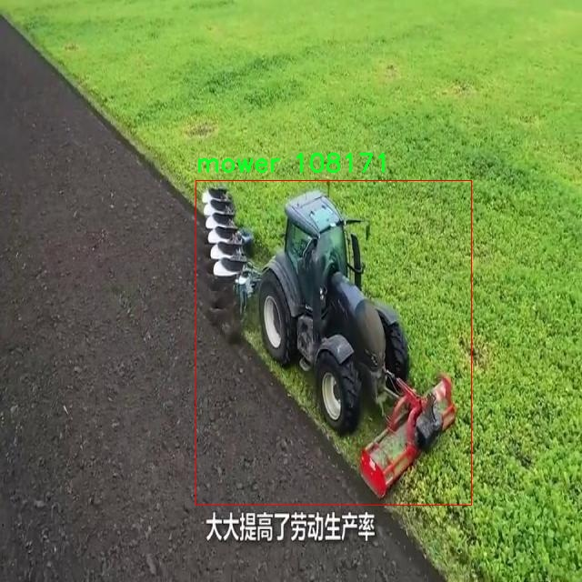

# 农业机械检测检测系统源码分享
 # [一条龙教学YOLOV8标注好的数据集一键训练_70+全套改进创新点发刊_Web前端展示]

### 1.研究背景与意义

项目参考[AAAI Association for the Advancement of Artificial Intelligence](https://gitee.com/qunmasj/projects)

项目来源[AACV Association for the Advancement of Computer Vision](https://kdocs.cn/l/cszuIiCKVNis)

研究背景与意义

随着全球人口的不断增长和城市化进程的加快，农业生产面临着前所未有的挑战。为了提高农业生产效率，确保粮食安全，现代农业亟需依赖先进的技术手段来提升机械化水平。农业机械作为提高生产效率、降低劳动强度的重要工具，正逐渐成为现代农业不可或缺的一部分。然而，随着农业机械种类的多样化和应用场景的复杂化，如何有效地识别和管理这些机械设备，成为了一个亟待解决的问题。

在这一背景下，计算机视觉技术的快速发展为农业机械的检测与管理提供了新的解决方案。YOLO（You Only Look Once）系列算法因其高效的实时目标检测能力，已广泛应用于各类物体识别任务。YOLOv8作为该系列的最新版本，凭借其在准确性和速度上的优势，成为了研究者们关注的焦点。然而，针对农业机械的检测任务，现有的YOLOv8模型在特定场景下的表现仍有提升空间。因此，基于改进YOLOv8的农业机械检测系统的研究具有重要的现实意义。

本研究所使用的数据集“AgriVehicle”包含7400张图像，涵盖了七类农业机械，包括无人机、收割机、旋耕机、移栽机、小型拖拉机、割草机和拖拉机。这些数据的多样性和丰富性为模型的训练和测试提供了良好的基础。通过对这些图像的深入分析与处理，改进YOLOv8模型可以更好地适应农业机械的特征，提升其在复杂环境下的检测能力。例如，无人机在农业监测中的应用日益广泛，而收割机和拖拉机等大型机械则在田间作业中占据重要地位。针对不同类型机械的特征提取和分类，不仅能够提高检测的准确性，还能为农业管理提供数据支持。

此外，农业机械的智能化管理是实现精准农业的重要组成部分。通过构建基于改进YOLOv8的农业机械检测系统，可以实现对农业机械的实时监控与管理，提升农业生产的智能化水平。这不仅有助于提高农业生产效率，降低人力成本，还能为农业机械的调度与维护提供科学依据，进而推动农业现代化的进程。

综上所述，基于改进YOLOv8的农业机械检测系统的研究，不仅在理论上丰富了计算机视觉与农业机械领域的交叉研究，也在实践中为农业生产提供了切实可行的解决方案。通过对农业机械的精准识别与管理，能够有效提升农业生产的效率与安全性，为实现可持续农业发展贡献力量。因此，本研究具有重要的学术价值和广泛的应用前景。

### 2.图片演示







##### 注意：由于此博客编辑较早，上面“2.图片演示”和“3.视频演示”展示的系统图片或者视频可能为老版本，新版本在老版本的基础上升级如下：（实际效果以升级的新版本为准）

  （1）适配了YOLOV8的“目标检测”模型和“实例分割”模型，通过加载相应的权重（.pt）文件即可自适应加载模型。

  （2）支持“图片识别”、“视频识别”、“摄像头实时识别”三种识别模式。

  （3）支持“图片识别”、“视频识别”、“摄像头实时识别”三种识别结果保存导出，解决手动导出（容易卡顿出现爆内存）存在的问题，识别完自动保存结果并导出到tempDir中。

  （4）支持Web前端系统中的标题、背景图等自定义修改，后面提供修改教程。

  另外本项目提供训练的数据集和训练教程,暂不提供权重文件（best.pt）,需要您按照教程进行训练后实现图片演示和Web前端界面演示的效果。

### 3.视频演示

[3.1 视频演示](https://www.bilibili.com/video/BV1Q54ueBEy1/)

### 4.数据集信息展示

##### 4.1 本项目数据集详细数据（类别数＆类别名）

nc: 7
names: ['Drone', 'Harvester', 'Rotocultivator', 'Transplanter', 'minitractor', 'mower', 'tractor']


##### 4.2 本项目数据集信息介绍

数据集信息展示

在现代农业生产中，智能化技术的应用正逐渐成为提升生产效率和降低劳动成本的重要手段。为了实现这一目标，开发一个高效的农业机械检测系统显得尤为重要。为此，我们采用了名为“AgriVehicle”的数据集，以改进YOLOv8模型在农业机械检测中的表现。该数据集专门针对农业机械的多样性进行了精心设计，涵盖了七个主要类别，分别是无人机、收割机、旋耕机、移栽机、小型拖拉机、割草机和拖拉机。这些类别不仅代表了现代农业中常见的机械设备，还反映了不同作业环节的需求。

“AgriVehicle”数据集的构建旨在为农业机械的自动检测提供丰富的样本支持。无人机作为现代农业中不可或缺的工具，主要用于监测作物生长、喷洒农药等任务，其在数据集中占据了重要地位。收割机则是秋收季节的主力军，能够高效完成大面积作物的收割，数据集中包含了多种型号的收割机样本，以便于模型学习其特征。旋耕机和移栽机则分别对应土壤耕作和作物种植的环节，这两类机械的样本同样在数据集中得到了充分体现。

此外，小型拖拉机、割草机和拖拉机作为农业生产中常用的机械设备，涵盖了从田间作业到草地管理的多个方面。小型拖拉机因其灵活性和多功能性而受到广泛欢迎，而割草机则在草地管理中发挥着重要作用。拖拉机则是农业机械化的核心，能够承担多种作业任务。通过对这些类别的详细标注和分类，数据集为YOLOv8模型的训练提供了坚实的基础。

在数据集的构建过程中，研究团队采用了多种数据采集手段，包括实地拍摄、视频捕捉以及合成数据生成等方式，以确保数据的多样性和真实性。每个类别的样本均经过精细标注，确保模型在训练过程中能够准确识别不同类型的农业机械。数据集的样本量经过严格筛选，力求在保证数据质量的前提下，尽可能覆盖不同的环境和使用场景，以增强模型的泛化能力。

为了进一步提升模型的性能，数据集还考虑了不同光照、天气和地形条件下的样本收集，使得训练出的模型能够在实际应用中表现出色。这种多样化的数据集设计不仅有助于提高YOLOv8在农业机械检测中的准确性和鲁棒性，还为后续的研究和应用提供了丰富的参考资料。

总之，“AgriVehicle”数据集的构建不仅为农业机械检测系统的开发提供了必要的数据支持，也为智能农业的发展奠定了基础。通过对该数据集的深入研究和应用，我们期待能够推动农业机械检测技术的进步，助力农业生产的智能化转型。










### 5.全套项目环境部署视频教程（零基础手把手教学）

[5.1 环境部署教程链接（零基础手把手教学）](https://www.ixigua.com/7404473917358506534?logTag=c807d0cbc21c0ef59de5)


[5.2 安装Python虚拟环境创建和依赖库安装视频教程链接（零基础手把手教学）](https://www.ixigua.com/7404474678003106304?logTag=1f1041108cd1f708b01a)

### 6.手把手YOLOV8训练视频教程（零基础小白有手就能学会）

[6.1 手把手YOLOV8训练视频教程（零基础小白有手就能学会）](https://www.ixigua.com/7404477157818401292?logTag=d31a2dfd1983c9668658)

### 7.70+种全套YOLOV8创新点代码加载调参视频教程（一键加载写好的改进模型的配置文件）

[7.1 70+种全套YOLOV8创新点代码加载调参视频教程（一键加载写好的改进模型的配置文件）](https://www.ixigua.com/7404478314661806627?logTag=29066f8288e3f4eea3a4)

### 8.70+种全套YOLOV8创新点原理讲解（非科班也可以轻松写刊发刊，V10版本正在科研待更新）

由于篇幅限制，每个创新点的具体原理讲解就不一一展开，具体见下列网址中的创新点对应子项目的技术原理博客网址【Blog】：


[8.1 70+种全套YOLOV8创新点原理讲解链接](https://gitee.com/qunmasj/good)

### 9.系统功能展示（检测对象为举例，实际内容以本项目数据集为准）

图9.1.系统支持检测结果表格显示

  图9.2.系统支持置信度和IOU阈值手动调节

  图9.3.系统支持自定义加载权重文件best.pt(需要你通过步骤5中训练获得)

  图9.4.系统支持摄像头实时识别

  图9.5.系统支持图片识别

  图9.6.系统支持视频识别

  图9.7.系统支持识别结果文件自动保存

  图9.8.系统支持Excel导出检测结果数据


### 10.原始YOLOV8算法原理

原始YOLOv8算法原理

YOLOv8算法是由Ultralytics公司于2023年推出的最新一代YOLO系列目标检测算法，其设计理念是为了在保证高效性和准确性的同时，适应不同应用场景的需求。YOLOv8的推出标志着目标检测技术的又一次重要进步，其核心在于优化模型结构、提升推理速度和准确性，以及增强模型的灵活性和可扩展性。

YOLOv8的架构主要由三个部分组成：输入端（Input）、主干网络（Backbone）和检测端（Head）。在这三个部分中，主干网络负责特征提取，颈部结构则负责特征融合，而检测端则实现了最终的目标检测任务。与之前的YOLO版本相比，YOLOv8在模型设计上进行了多项创新，尤其是在网络结构的优化和损失函数的设计上，力求在轻量化的同时提升模型的性能。

在YOLOv8中，模型提供了五种不同的尺度，分别为YOLOv8n、YOLOv8s、YOLOv8m、YOLOv8l和YOLOv8x。这些模型的设计并不是简单地按照固定的缩放系数进行调整，而是通过动态调整主干网络的通道数，以达到最佳的性能表现。以YOLOv8n为例，其网络结构经过精心设计，确保在较小的模型规模下依然能够保持较高的检测精度和推理速度。

YOLOv8的主干网络采用了CSP（Cross Stage Partial）结构，这种结构将特征提取过程分为两个部分，分别进行卷积和连接操作，从而有效地减少了计算量并提高了特征提取的效率。为了进一步提升模型的计算速度，YOLOv8在主干网络的末尾引入了SPPF（Spatial Pyramid Pooling Fast）模块，这一模块通过多尺度的特征池化，增强了模型对不同尺寸目标的检测能力。

在特征融合方面，YOLOv8依然采用了PAN-FPN（Path Aggregation Network - Feature Pyramid Network）结构，然而与以往的YOLO版本不同的是，YOLOv8在上采样部分去掉了卷积结构，这一改动使得特征融合过程更加高效。此外，YOLOv8引入了C2f模块，取代了YOLOv5中的C3模块。C2f模块结合了YOLOv7中的ELAN（Efficient Layer Aggregation Network）模块的思想，增加了更多的残差连接，从而在保持模型轻量化的同时，获得了更丰富的梯度信息。这种创新的模块设计，使得YOLOv8在特征提取和融合的过程中，能够更好地捕捉到目标的细节信息。

在检测端，YOLOv8采用了目前流行的解耦合头结构，将分类和检测头分离。这一设计使得模型在处理目标检测任务时，能够更加灵活地应对不同类型的目标。此外，YOLOv8摒弃了传统的Anchor-Based方法，转而采用Anchor-Free的检测方式，这一创新使得模型在处理复杂场景时，能够更好地适应目标的多样性和不确定性。

在训练过程中，YOLOv8引入了动态Task-Aligned Assigner样本分配策略，并在数据增强方面进行了优化，特别是在训练的最后10个epoch中关闭了马赛克增强。这些改进使得模型在训练过程中能够更有效地学习到目标的特征，从而提升了最终的检测性能。

在损失函数的设计上，YOLOv8采用了BCELoss（Binary Cross Entropy Loss）作为分类损失，同时结合DFLLoss和CIoULoss作为回归损失。这种多损失函数的组合，能够更全面地评估模型的性能，确保在分类和定位任务中都能达到较高的准确性。

总的来说，YOLOv8在算法原理上通过一系列的创新设计，实现了更快的推理速度和更高的检测精度，成为了目标检测领域中的一项重要技术。其灵活的模型设置和高效的特征提取与融合机制，使得YOLOv8能够广泛应用于各种实际场景中，满足不同用户的需求。随着YOLOv8的不断发展和完善，未来在目标检测领域的应用前景将更加广阔。


### 11.项目核心源码讲解（再也不用担心看不懂代码逻辑）

#### 11.1 ui.py

以下是经过精简和详细注释的核心代码部分：

```python
import sys
import subprocess

def run_script(script_path):
    """
    使用当前 Python 环境运行指定的脚本。

    Args:
        script_path (str): 要运行的脚本路径

    Returns:
        None
    """
    # 获取当前 Python 解释器的路径
    python_path = sys.executable

    # 构建运行命令，使用 streamlit 运行指定的脚本
    command = f'"{python_path}" -m streamlit run "{script_path}"'

    # 执行命令并等待其完成
    result = subprocess.run(command, shell=True)
    
    # 检查命令执行结果，如果返回码不为0，表示执行出错
    if result.returncode != 0:
        print("脚本运行出错。")

# 主程序入口
if __name__ == "__main__":
    # 指定要运行的脚本路径
    script_path = "web.py"  # 假设脚本在当前目录下

    # 调用函数运行脚本
    run_script(script_path)
```

### 代码分析与注释：
1. **导入模块**：
   - `sys`：用于访问与 Python 解释器紧密相关的变量和函数。
   - `subprocess`：用于执行外部命令和程序。

2. **`run_script` 函数**：
   - 功能：运行指定路径的 Python 脚本。
   - 参数：`script_path`，要运行的脚本的路径。
   - 过程：
     - 获取当前 Python 解释器的路径，确保使用正确的 Python 环境。
     - 构建命令字符串，使用 `streamlit` 运行指定的脚本。
     - 使用 `subprocess.run` 执行命令，并等待其完成。
     - 检查返回码，如果不为0，表示脚本运行出错，输出错误信息。

3. **主程序入口**：
   - 通过 `if __name__ == "__main__":` 确保只有在直接运行该脚本时才会执行以下代码。
   - 指定要运行的脚本路径（在这里假设为 `web.py`）。
   - 调用 `run_script` 函数来执行该脚本。 

这个精简版本保留了核心功能，并提供了必要的注释以帮助理解代码的作用和流程。

这个文件名为 `ui.py`，它的主要功能是通过当前的 Python 环境来运行一个指定的脚本。文件中首先导入了必要的模块，包括 `sys`、`os` 和 `subprocess`，以及一个自定义的模块 `QtFusion.path` 中的 `abs_path` 函数。

在文件的主体部分，定义了一个名为 `run_script` 的函数，该函数接受一个参数 `script_path`，表示要运行的脚本的路径。函数内部首先获取当前 Python 解释器的路径，使用 `sys.executable` 来实现。接着，构建一个命令字符串，使用 `streamlit` 来运行指定的脚本，这里 `streamlit` 是一个用于构建和分享数据应用的框架。

然后，使用 `subprocess.run` 方法来执行这个命令，`shell=True` 参数表示在一个新的 shell 中执行命令。执行完命令后，检查返回码 `result.returncode`，如果不等于 0，说明脚本运行过程中出现了错误，此时会打印出一条错误信息。

在文件的最后部分，使用 `if __name__ == "__main__":` 来判断当前模块是否是主程序。如果是，则指定要运行的脚本路径，这里使用了 `abs_path` 函数来获取 `web.py` 的绝对路径。最后调用 `run_script` 函数来执行这个脚本。

总体来说，这个文件的作用是提供一个简单的接口，通过命令行运行一个名为 `web.py` 的脚本，并处理可能出现的错误。

#### 11.2 code\ultralytics\utils\dist.py

以下是代码中最核心的部分，并附上详细的中文注释：

```python
import os
import shutil
import socket
import sys
import tempfile

from . import USER_CONFIG_DIR
from .torch_utils import TORCH_1_9

def find_free_network_port() -> int:
    """
    查找本地主机上一个空闲的网络端口。

    在单节点训练时非常有用，因为我们不想连接到真实的主节点，但必须设置
    `MASTER_PORT` 环境变量。
    """
    with socket.socket(socket.AF_INET, socket.SOCK_STREAM) as s:
        s.bind(("127.0.0.1", 0))  # 绑定到本地地址和一个随机端口
        return s.getsockname()[1]  # 返回绑定的端口号


def generate_ddp_file(trainer):
    """生成一个 DDP 文件并返回其文件名。"""
    # 获取训练器的模块和类名
    module, name = f"{trainer.__class__.__module__}.{trainer.__class__.__name__}".rsplit(".", 1)

    # 创建 DDP 文件的内容
    content = f"""
# Ultralytics 多 GPU 训练临时文件（使用后应自动删除）
overrides = {vars(trainer.args)}

if __name__ == "__main__":
    from {module} import {name}
    from ultralytics.utils import DEFAULT_CFG_DICT

    cfg = DEFAULT_CFG_DICT.copy()
    cfg.update(save_dir='')   # 处理额外的键 'save_dir'
    trainer = {name}(cfg=cfg, overrides=overrides)
    results = trainer.train()
"""
    # 创建 DDP 目录（如果不存在）
    (USER_CONFIG_DIR / "DDP").mkdir(exist_ok=True)
    # 创建一个临时文件并写入内容
    with tempfile.NamedTemporaryFile(
        prefix="_temp_",
        suffix=f"{id(trainer)}.py",
        mode="w+",
        encoding="utf-8",
        dir=USER_CONFIG_DIR / "DDP",
        delete=False,
    ) as file:
        file.write(content)  # 写入内容到临时文件
    return file.name  # 返回临时文件的名称


def generate_ddp_command(world_size, trainer):
    """生成并返回分布式训练的命令。"""
    import __main__  # 本地导入以避免某些问题

    if not trainer.resume:
        shutil.rmtree(trainer.save_dir)  # 如果不恢复训练，则删除保存目录
    file = generate_ddp_file(trainer)  # 生成 DDP 文件
    dist_cmd = "torch.distributed.run" if TORCH_1_9 else "torch.distributed.launch"  # 根据 PyTorch 版本选择命令
    port = find_free_network_port()  # 查找空闲端口
    # 构建命令行参数
    cmd = [sys.executable, "-m", dist_cmd, "--nproc_per_node", f"{world_size}", "--master_port", f"{port}", file]
    return cmd, file  # 返回命令和文件名


def ddp_cleanup(trainer, file):
    """如果创建了临时文件，则删除它。"""
    if f"{id(trainer)}.py" in file:  # 检查临时文件的后缀
        os.remove(file)  # 删除临时文件
```

### 代码说明：
1. **查找空闲端口**：`find_free_network_port` 函数用于查找本地主机上一个可用的网络端口，这在设置分布式训练时非常重要。
2. **生成 DDP 文件**：`generate_ddp_file` 函数生成一个临时的 DDP 文件，该文件包含训练器的配置和训练逻辑，并返回文件名。
3. **生成训练命令**：`generate_ddp_command` 函数构建分布式训练的命令，包括使用的进程数和主节点端口等信息。
4. **清理临时文件**：`ddp_cleanup` 函数用于在训练结束后删除生成的临时文件，以避免文件堆积。

这个程序文件主要用于处理与分布式训练相关的功能，特别是在使用Ultralytics YOLO框架进行多GPU训练时。文件中包含几个重要的函数，每个函数都有其特定的功能。

首先，`find_free_network_port`函数用于查找本地主机上可用的网络端口。这个功能在单节点训练时非常有用，因为在这种情况下，我们不需要连接到真正的主节点，但仍然需要设置`MASTER_PORT`环境变量。该函数通过创建一个TCP套接字并将其绑定到本地地址和随机端口来实现这一点，最终返回可用的端口号。

接下来，`generate_ddp_file`函数用于生成一个分布式数据并行（DDP）训练的临时文件，并返回该文件的名称。这个函数首先获取训练器的类模块和名称，然后构建一个包含训练参数的Python脚本内容。该脚本内容定义了如何使用给定的配置和参数来初始化训练器并开始训练。生成的文件被存储在用户配置目录下的“DDP”文件夹中，并且在创建时会确保该文件夹存在。使用`tempfile.NamedTemporaryFile`创建临时文件时，设置了特定的前缀和后缀，以便于识别。

`generate_ddp_command`函数用于生成分布式训练的命令。它首先检查训练器是否需要恢复之前的训练状态，如果不需要，则删除保存目录。然后调用`generate_ddp_file`生成临时文件，并根据PyTorch的版本选择合适的分布式命令（`torch.distributed.run`或`torch.distributed.launch`）。该函数还会调用`find_free_network_port`来获取一个可用的端口，最终返回一个包含命令和临时文件名的列表。

最后，`ddp_cleanup`函数用于在训练完成后清理临时文件。如果生成的临时文件的后缀与训练器的ID匹配，则会删除该文件，以避免在文件系统中留下不必要的临时文件。

整体来看，这个文件为Ultralytics YOLO框架提供了支持分布式训练的工具，确保训练过程中的临时文件管理和网络端口的使用都是高效且自动化的。

#### 11.3 70+种YOLOv8算法改进源码大全和调试加载训练教程（非必要）\ultralytics\models\yolo\classify\train.py

以下是代码中最核心的部分，并附上详细的中文注释：

```python
import torch
from ultralytics.data import ClassificationDataset, build_dataloader
from ultralytics.engine.trainer import BaseTrainer
from ultralytics.models import yolo
from ultralytics.nn.tasks import ClassificationModel, attempt_load_one_weight
from ultralytics.utils import DEFAULT_CFG, LOGGER, RANK
from ultralytics.utils.torch_utils import is_parallel, strip_optimizer, torch_distributed_zero_first

class ClassificationTrainer(BaseTrainer):
    """
    扩展自 BaseTrainer 类的分类训练器，用于基于分类模型的训练。
    """

    def __init__(self, cfg=DEFAULT_CFG, overrides=None, _callbacks=None):
        """初始化 ClassificationTrainer 对象，支持配置覆盖和回调函数。"""
        if overrides is None:
            overrides = {}
        overrides['task'] = 'classify'  # 设置任务类型为分类
        if overrides.get('imgsz') is None:
            overrides['imgsz'] = 224  # 默认图像大小为224
        super().__init__(cfg, overrides, _callbacks)

    def get_model(self, cfg=None, weights=None, verbose=True):
        """返回配置好的 PyTorch 分类模型。"""
        model = ClassificationModel(cfg, nc=self.data['nc'], verbose=verbose and RANK == -1)
        if weights:
            model.load(weights)  # 加载权重

        for m in model.modules():
            if not self.args.pretrained and hasattr(m, 'reset_parameters'):
                m.reset_parameters()  # 重置模型参数
            if isinstance(m, torch.nn.Dropout) and self.args.dropout:
                m.p = self.args.dropout  # 设置 dropout 概率
        for p in model.parameters():
            p.requires_grad = True  # 设置为可训练
        return model

    def build_dataset(self, img_path, mode='train', batch=None):
        """根据图像路径和模式（训练/测试等）创建 ClassificationDataset 实例。"""
        return ClassificationDataset(root=img_path, args=self.args, augment=mode == 'train', prefix=mode)

    def get_dataloader(self, dataset_path, batch_size=16, rank=0, mode='train'):
        """返回带有图像预处理的 PyTorch DataLoader。"""
        with torch_distributed_zero_first(rank):  # 在分布式训练中只初始化一次数据集
            dataset = self.build_dataset(dataset_path, mode)

        loader = build_dataloader(dataset, batch_size, self.args.workers, rank=rank)
        return loader  # 返回数据加载器

    def preprocess_batch(self, batch):
        """预处理一批图像和类别数据。"""
        batch['img'] = batch['img'].to(self.device)  # 将图像移动到设备上
        batch['cls'] = batch['cls'].to(self.device)  # 将类别标签移动到设备上
        return batch

    def get_validator(self):
        """返回用于验证的 ClassificationValidator 实例。"""
        self.loss_names = ['loss']  # 定义损失名称
        return yolo.classify.ClassificationValidator(self.test_loader, self.save_dir)

    def final_eval(self):
        """评估训练后的模型并保存验证结果。"""
        for f in self.last, self.best:
            if f.exists():
                strip_optimizer(f)  # 去除优化器信息
                if f is self.best:
                    LOGGER.info(f'\nValidating {f}...')
                    self.metrics = self.validator(model=f)  # 进行验证
                    self.metrics.pop('fitness', None)  # 移除不需要的指标
        LOGGER.info(f"Results saved to {self.save_dir}")  # 输出结果保存路径
```

### 代码核心部分说明：
1. **类的定义**：`ClassificationTrainer` 继承自 `BaseTrainer`，用于处理分类任务的训练。
2. **初始化方法**：`__init__` 方法设置任务类型和图像大小，并调用父类构造函数。
3. **模型获取**：`get_model` 方法创建并返回一个分类模型，并加载权重。
4. **数据集构建**：`build_dataset` 方法根据输入路径和模式创建数据集实例。
5. **数据加载器**：`get_dataloader` 方法返回一个数据加载器，用于批量加载数据。
6. **批处理预处理**：`preprocess_batch` 方法将图像和标签移动到指定设备上。
7. **验证器获取**：`get_validator` 方法返回一个验证器实例，用于模型验证。
8. **最终评估**：`final_eval` 方法在训练结束后评估模型并保存结果。

这个程序文件是一个用于训练YOLOv8分类模型的Python脚本，属于Ultralytics库的一部分。它继承自BaseTrainer类，专门用于处理图像分类任务。文件中包含了多个方法和类，用于设置模型、加载数据集、训练模型以及评估模型等功能。

首先，程序导入了必要的库，包括PyTorch和Torchvision，以及Ultralytics库中的一些模块。这些模块提供了数据集构建、模型训练和评估等功能。

ClassificationTrainer类是该文件的核心部分，它扩展了BaseTrainer类，专门用于分类任务。在初始化方法中，可以接受配置参数和回调函数。如果没有提供图像大小参数，默认设置为224。通过调用父类的初始化方法，完成基本的设置。

set_model_attributes方法用于从加载的数据集中设置YOLO模型的类名，以便在训练过程中使用。

get_model方法返回一个经过修改的PyTorch模型，适用于YOLO训练。它可以加载预训练权重，并根据需要重置模型参数。该方法确保模型的所有参数都可以进行训练。

setup_model方法负责加载、创建或下载模型。如果模型已经是一个PyTorch模块，则不需要再次设置。如果模型是以.pt结尾的文件，则尝试加载该权重；如果是以.yaml或.yml结尾的文件，则调用get_model方法获取模型；如果模型名称在Torchvision模型字典中，则加载相应的Torchvision模型。

build_dataset方法根据给定的图像路径和模式（训练或测试）创建一个ClassificationDataset实例。get_dataloader方法则返回一个PyTorch的DataLoader，用于预处理图像并为推理准备数据。

preprocess_batch方法对一批图像和类进行预处理，将其移动到指定的设备上。progress_string方法返回一个格式化的字符串，显示训练进度。

get_validator方法返回一个ClassificationValidator实例，用于模型验证。label_loss_items方法生成一个带有标签的训练损失项字典，尽管对于分类任务并不需要，但在分割和检测任务中是必要的。

plot_metrics方法用于从CSV文件中绘制指标，final_eval方法则用于评估训练后的模型并保存验证结果。最后，plot_training_samples方法用于绘制带有注释的训练样本。

整体来看，这个文件提供了一个完整的框架，用于训练YOLOv8分类模型，涵盖了从数据加载到模型评估的各个方面。通过合理配置参数，用户可以方便地进行模型训练和调试。

#### 11.4 train.py

以下是经过简化和注释的核心代码部分，主要集中在YOLO模型的训练和数据处理上：

```python
import random
import numpy as np
import torch.nn as nn
from ultralytics.data import build_dataloader, build_yolo_dataset
from ultralytics.engine.trainer import BaseTrainer
from ultralytics.models import yolo
from ultralytics.nn.tasks import DetectionModel
from ultralytics.utils import LOGGER, RANK
from ultralytics.utils.torch_utils import de_parallel, torch_distributed_zero_first

class DetectionTrainer(BaseTrainer):
    """
    基于检测模型的训练类，继承自BaseTrainer类。
    """

    def build_dataset(self, img_path, mode="train", batch=None):
        """
        构建YOLO数据集。

        参数:
            img_path (str): 包含图像的文件夹路径。
            mode (str): 模式，`train`或`val`，用户可以为每种模式自定义不同的数据增强。
            batch (int, optional): 批量大小，仅用于`rect`模式。默认为None。
        """
        gs = max(int(de_parallel(self.model).stride.max() if self.model else 0), 32)  # 获取模型的最大步幅
        return build_yolo_dataset(self.args, img_path, batch, self.data, mode=mode, rect=mode == "val", stride=gs)

    def get_dataloader(self, dataset_path, batch_size=16, rank=0, mode="train"):
        """构造并返回数据加载器。"""
        assert mode in ["train", "val"]  # 确保模式有效
        with torch_distributed_zero_first(rank):  # 在分布式训练中，仅初始化一次数据集
            dataset = self.build_dataset(dataset_path, mode, batch_size)
        shuffle = mode == "train"  # 训练模式下打乱数据
        workers = self.args.workers if mode == "train" else self.args.workers * 2  # 设置工作线程数
        return build_dataloader(dataset, batch_size, workers, shuffle, rank)  # 返回数据加载器

    def preprocess_batch(self, batch):
        """对图像批次进行预处理，包括缩放和转换为浮点数。"""
        batch["img"] = batch["img"].to(self.device, non_blocking=True).float() / 255  # 将图像转换为浮点数并归一化
        if self.args.multi_scale:  # 如果启用多尺度训练
            imgs = batch["img"]
            sz = (
                random.randrange(self.args.imgsz * 0.5, self.args.imgsz * 1.5 + self.stride)
                // self.stride
                * self.stride
            )  # 随机选择图像大小
            sf = sz / max(imgs.shape[2:])  # 计算缩放因子
            if sf != 1:
                ns = [
                    math.ceil(x * sf / self.stride) * self.stride for x in imgs.shape[2:]
                ]  # 计算新的图像形状
                imgs = nn.functional.interpolate(imgs, size=ns, mode="bilinear", align_corners=False)  # 调整图像大小
            batch["img"] = imgs  # 更新批次图像
        return batch

    def get_model(self, cfg=None, weights=None, verbose=True):
        """返回YOLO检测模型。"""
        model = DetectionModel(cfg, nc=self.data["nc"], verbose=verbose and RANK == -1)  # 创建检测模型
        if weights:
            model.load(weights)  # 加载权重
        return model

    def plot_training_samples(self, batch, ni):
        """绘制带有注释的训练样本。"""
        plot_images(
            images=batch["img"],
            batch_idx=batch["batch_idx"],
            cls=batch["cls"].squeeze(-1),
            bboxes=batch["bboxes"],
            paths=batch["im_file"],
            fname=self.save_dir / f"train_batch{ni}.jpg",
            on_plot=self.on_plot,
        )

    def plot_metrics(self):
        """从CSV文件中绘制指标。"""
        plot_results(file=self.csv, on_plot=self.on_plot)  # 保存结果图
```

### 代码注释说明：
1. **类和方法定义**：`DetectionTrainer`类继承自`BaseTrainer`，用于实现YOLO模型的训练。
2. **数据集构建**：`build_dataset`方法用于构建YOLO数据集，支持训练和验证模式。
3. **数据加载器**：`get_dataloader`方法构造数据加载器，支持分布式训练。
4. **批次预处理**：`preprocess_batch`方法对输入图像进行归一化和缩放处理，支持多尺度训练。
5. **模型获取**：`get_model`方法返回YOLO检测模型，并可选择加载预训练权重。
6. **绘图功能**：`plot_training_samples`和`plot_metrics`方法用于可视化训练样本和训练指标。

这个程序文件 `train.py` 是一个用于训练 YOLO（You Only Look Once）目标检测模型的 Python 脚本，主要依赖于 Ultralytics 提供的库。程序通过继承 `BaseTrainer` 类来实现目标检测的训练流程。

首先，程序导入了一些必要的库和模块，包括数学运算、随机数生成、深度学习框架 PyTorch 相关的模块，以及 Ultralytics 提供的数据处理、模型构建和训练工具。

在 `DetectionTrainer` 类中，定义了一系列方法来支持模型的训练过程。`build_dataset` 方法用于构建 YOLO 数据集，接受图像路径、模式（训练或验证）和批次大小作为参数。它通过调用 `build_yolo_dataset` 函数来创建数据集，支持不同模式下的图像增强。

`get_dataloader` 方法用于构建数据加载器，确保在分布式训练时只初始化一次数据集。它会根据模式选择是否打乱数据，并设置工作线程的数量。数据加载器的构建是通过 `build_dataloader` 函数完成的。

`preprocess_batch` 方法负责对输入的图像批次进行预处理，包括将图像缩放到合适的大小并转换为浮点数格式。该方法还支持多尺度训练，通过随机选择图像的大小来增强模型的鲁棒性。

`set_model_attributes` 方法用于设置模型的属性，包括类别数量和类别名称，以便模型能够正确处理不同的目标类别。

`get_model` 方法返回一个 YOLO 检测模型的实例，并可以加载预训练的权重。`get_validator` 方法返回一个用于模型验证的 `DetectionValidator` 实例，能够计算训练过程中的损失。

`label_loss_items` 方法用于返回一个包含训练损失项的字典，方便监控训练过程中的损失变化。`progress_string` 方法则格式化并返回当前训练进度的字符串，包括当前的轮次、GPU 内存使用情况和损失值等信息。

此外，程序还包含了一些可视化方法，例如 `plot_training_samples` 用于绘制训练样本及其标注，`plot_metrics` 用于绘制从 CSV 文件中读取的训练指标，`plot_training_labels` 用于创建带标签的训练图像。

总体而言，这个程序文件实现了 YOLO 模型的训练框架，涵盖了数据集构建、数据加载、模型设置、训练过程监控和结果可视化等多个方面，适合用于目标检测任务的训练。

#### 11.5 70+种YOLOv8算法改进源码大全和调试加载训练教程（非必要）\ultralytics\utils\triton.py

以下是保留的核心代码部分，并添加了详细的中文注释：

```python
import numpy as np
from urllib.parse import urlsplit

class TritonRemoteModel:
    """
    与远程Triton推理服务器模型交互的客户端。

    属性:
        endpoint (str): Triton服务器上模型的名称。
        url (str): Triton服务器的URL。
        triton_client: Triton客户端（HTTP或gRPC）。
        InferInput: Triton客户端的输入类。
        InferRequestedOutput: Triton客户端的输出请求类。
        input_formats (List[str]): 模型输入的数据类型。
        np_input_formats (List[type]): 模型输入的numpy数据类型。
        input_names (List[str]): 模型输入的名称。
        output_names (List[str]): 模型输出的名称。
    """

    def __init__(self, url: str, endpoint: str = '', scheme: str = ''):
        """
        初始化TritonRemoteModel。

        参数可以单独提供，也可以从一个集体的'url'参数解析，格式为
            <scheme>://<netloc>/<endpoint>/<task_name>

        参数:
            url (str): Triton服务器的URL。
            endpoint (str): Triton服务器上模型的名称。
            scheme (str): 通信方案（'http'或'gRPC'）。
        """
        # 如果没有提供endpoint和scheme，则从URL字符串解析所有参数
        if not endpoint and not scheme:
            splits = urlsplit(url)  # 解析URL
            endpoint = splits.path.strip('/').split('/')[0]  # 获取模型名称
            scheme = splits.scheme  # 获取通信方案
            url = splits.netloc  # 获取网络位置

        self.endpoint = endpoint  # 设置模型名称
        self.url = url  # 设置服务器URL

        # 根据通信方案选择Triton客户端
        if scheme == 'http':
            import tritonclient.http as client  # 导入HTTP客户端
            self.triton_client = client.InferenceServerClient(url=self.url, verbose=False, ssl=False)
            config = self.triton_client.get_model_config(endpoint)  # 获取模型配置
        else:
            import tritonclient.grpc as client  # 导入gRPC客户端
            self.triton_client = client.InferenceServerClient(url=self.url, verbose=False, ssl=False)
            config = self.triton_client.get_model_config(endpoint, as_json=True)['config']  # 获取模型配置

        # 按字母顺序对输出名称进行排序
        config['output'] = sorted(config['output'], key=lambda x: x.get('name'))

        # 定义模型属性
        type_map = {'TYPE_FP32': np.float32, 'TYPE_FP16': np.float16, 'TYPE_UINT8': np.uint8}  # 数据类型映射
        self.InferRequestedOutput = client.InferRequestedOutput  # 输出请求类
        self.InferInput = client.InferInput  # 输入类
        self.input_formats = [x['data_type'] for x in config['input']]  # 获取输入数据类型
        self.np_input_formats = [type_map[x] for x in self.input_formats]  # 获取numpy数据类型
        self.input_names = [x['name'] for x in config['input']]  # 获取输入名称
        self.output_names = [x['name'] for x in config['output']]  # 获取输出名称

    def __call__(self, *inputs: np.ndarray) -> List[np.ndarray]:
        """
        使用给定的输入调用模型。

        参数:
            *inputs (List[np.ndarray]): 模型的输入数据。

        返回:
            List[np.ndarray]: 模型输出。
        """
        infer_inputs = []  # 初始化输入列表
        input_format = inputs[0].dtype  # 获取输入数据类型
        for i, x in enumerate(inputs):
            # 如果输入数据类型与模型期望的不一致，则进行类型转换
            if x.dtype != self.np_input_formats[i]:
                x = x.astype(self.np_input_formats[i])
            # 创建InferInput对象并设置数据
            infer_input = self.InferInput(self.input_names[i], [*x.shape], self.input_formats[i].replace('TYPE_', ''))
            infer_input.set_data_from_numpy(x)  # 从numpy数组设置数据
            infer_inputs.append(infer_input)  # 添加到输入列表

        # 创建输出请求对象
        infer_outputs = [self.InferRequestedOutput(output_name) for output_name in self.output_names]
        # 调用Triton客户端进行推理
        outputs = self.triton_client.infer(model_name=self.endpoint, inputs=infer_inputs, outputs=infer_outputs)

        # 返回输出结果，转换为原始输入数据类型
        return [outputs.as_numpy(output_name).astype(input_format) for output_name in self.output_names]
```

### 代码说明：
1. **类定义**：`TritonRemoteModel`类用于与Triton推理服务器进行交互。
2. **初始化方法**：构造函数接受URL、模型名称和通信方案，并根据这些信息初始化Triton客户端。
3. **输入和输出处理**：在`__call__`方法中，处理输入数据并将其转换为Triton服务器所需的格式，然后进行推理并返回输出结果。

该程序文件定义了一个名为 `TritonRemoteModel` 的类，用于与远程的 Triton 推理服务器模型进行交互。这个类的主要功能是通过 HTTP 或 gRPC 协议与 Triton 服务器进行通信，以便发送输入数据并接收模型的输出结果。

在类的初始化方法 `__init__` 中，用户可以通过 URL、模型端点和通信协议来创建 `TritonRemoteModel` 的实例。如果用户没有提供端点和协议，程序会从 URL 中解析这些信息。URL 的格式应为 `<scheme>://<netloc>/<endpoint>/<task_name>`。初始化过程中，程序会根据指定的通信协议选择相应的 Triton 客户端，并获取模型的配置。模型的输入和输出信息会被提取并存储为类的属性，以便后续使用。

在 `__call__` 方法中，用户可以将输入数据传递给模型进行推理。该方法接受多个 NumPy 数组作为输入，首先会检查输入数据的类型是否与模型要求的类型一致，如果不一致，则会进行类型转换。接着，程序会为每个输入创建一个 `InferInput` 对象，并将数据设置到该对象中。然后，程序会创建输出请求对象 `InferRequestedOutput`，并调用 Triton 客户端的 `infer` 方法进行推理。最后，模型的输出结果会被转换为 NumPy 数组并返回。

整体来看，这个类封装了与 Triton 推理服务器的交互细节，使得用户可以方便地进行模型推理，而无需深入了解底层的通信实现。

#### 11.6 code\ultralytics\nn\modules\head.py

以下是经过简化和注释的代码，保留了核心部分并添加了详细的中文注释：

```python
import torch
import torch.nn as nn
from .conv import Conv
from .utils import bias_init_with_prob, linear_init

class Detect(nn.Module):
    """YOLOv8 检测头，用于目标检测模型。"""

    def __init__(self, nc=80, ch=()):
        """初始化 YOLOv8 检测层，指定类别数和通道数。"""
        super().__init__()
        self.nc = nc  # 类别数
        self.nl = len(ch)  # 检测层数
        self.reg_max = 16  # DFL 通道数
        self.no = nc + self.reg_max * 4  # 每个锚点的输出数量
        self.stride = torch.zeros(self.nl)  # 在构建时计算的步幅

        # 定义卷积层
        c2 = max((16, ch[0] // 4, self.reg_max * 4))
        c3 = max(ch[0], min(self.nc, 100))
        self.cv2 = nn.ModuleList(
            nn.Sequential(Conv(x, c2, 3), Conv(c2, c2, 3), nn.Conv2d(c2, 4 * self.reg_max, 1)) for x in ch
        )
        self.cv3 = nn.ModuleList(nn.Sequential(Conv(x, c3, 3), Conv(c3, c3, 3), nn.Conv2d(c3, self.nc, 1)) for x in ch)

    def forward(self, x):
        """连接并返回预测的边界框和类别概率。"""
        for i in range(self.nl):
            x[i] = torch.cat((self.cv2[i](x[i]), self.cv3[i](x[i])), 1)  # 将卷积层的输出连接
        shape = x[0].shape  # 获取输入形状
        x_cat = torch.cat([xi.view(shape[0], self.no, -1) for xi in x], 2)  # 连接所有层的输出

        # 解码边界框
        box, cls = x_cat.split((self.reg_max * 4, self.nc), 1)  # 分割出边界框和类别
        dbox = self.decode_bboxes(box)  # 解码边界框

        # 返回边界框和类别概率
        return torch.cat((dbox, cls.sigmoid()), 1)  # 将边界框和类别概率连接返回

    def decode_bboxes(self, bboxes):
        """解码边界框。"""
        return bboxes  # 此处应包含实际的解码逻辑

class Classify(nn.Module):
    """YOLOv8 分类头，将输入从 (b, c1, 20, 20) 转换为 (b, c2)。"""

    def __init__(self, c1, c2):
        """初始化 YOLOv8 分类头，指定输入和输出通道。"""
        super().__init__()
        self.conv = Conv(c1, 1280, 3)  # 卷积层
        self.pool = nn.AdaptiveAvgPool2d(1)  # 自适应平均池化
        self.linear = nn.Linear(1280, c2)  # 全连接层

    def forward(self, x):
        """执行前向传播，返回分类结果。"""
        x = self.linear(self.pool(self.conv(x)).flatten(1))  # 通过卷积、池化和全连接层
        return x.softmax(1)  # 返回经过 softmax 的结果

# 其他类如 Segment、OBB、Pose 和 RTDETRDecoder 可以根据需要进行类似的简化和注释
```

### 代码说明：
1. **Detect 类**：这是 YOLOv8 的检测头，负责处理输入的特征图并输出边界框和类别概率。构造函数中定义了卷积层，`forward` 方法中连接了各层的输出，并解码边界框。
2. **Classify 类**：这是 YOLOv8 的分类头，负责将特征图转换为类别预测。它包含卷积层、池化层和全连接层，`forward` 方法执行前向传播并返回经过 softmax 的结果。

其他类（如 Segment、OBB、Pose 和 RTDETRDecoder）可以根据需要进行类似的简化和注释。

这个程序文件是Ultralytics YOLO（You Only Look Once）模型的一部分，主要实现了不同类型的检测头模块，包括目标检测、分割、姿态估计、分类和旋转边界框检测等。文件中定义了多个类，每个类负责不同的功能，具体如下：

首先，文件导入了必要的库，包括PyTorch和一些自定义的模块。接着，定义了一个名为`Detect`的类，它是YOLOv8检测头的基础类。这个类的构造函数接受类别数量和通道数作为参数，并初始化了一些重要的属性，如输出数量、步幅和卷积层。`forward`方法负责将输入特征图通过卷积层处理，生成预测的边界框和类别概率。在训练和推理阶段，处理流程略有不同。

接下来，`Segment`类继承自`Detect`，用于分割模型。它在构造函数中增加了掩码和原型的数量，并定义了额外的卷积层。在`forward`方法中，除了返回检测结果外，还返回掩码系数和原型。

`OBB`类也是继承自`Detect`，用于处理带有旋转的边界框检测。它在构造函数中增加了额外参数的数量，并在`forward`方法中计算和返回旋转角度。

`Pose`类同样继承自`Detect`，用于关键点检测。它定义了关键点的形状，并在`forward`方法中处理关键点的预测。

`Classify`类是YOLOv8的分类头，负责将输入的特征图转换为类别预测。它使用卷积层、池化层和全连接层来实现这一功能。

最后，`RTDETRDecoder`类实现了实时可变形Transformer解码器模块，结合了Transformer架构和可变形卷积，负责生成边界框和分类分数。它的构造函数接受多个参数来初始化网络结构，包括隐藏层维度、查询点数量、解码层数量等。在`forward`方法中，处理输入特征并通过解码器生成最终的预测结果。

整个文件通过定义这些类，提供了YOLOv8模型的不同功能模块，使得模型能够在多种任务中应用，如目标检测、分割、姿态估计等。每个类的设计都考虑到了不同的输出需求和网络结构，确保了模型的灵活性和扩展性。

### 12.系统整体结构（节选）

### 整体功能和构架概括

该程序是一个完整的YOLOv8目标检测框架，旨在提供高效的目标检测、图像分类、分割和姿态估计等功能。它的架构由多个模块组成，包括数据处理、模型训练、推理、结果可视化和与外部服务的交互等。以下是主要功能模块的概述：

1. **用户界面（UI）**：提供命令行接口，允许用户运行和管理训练过程。
2. **分布式训练支持**：处理多GPU训练的配置和管理。
3. **模型训练**：实现YOLOv8模型的训练过程，包括数据加载、模型构建和损失计算。
4. **推理支持**：与Triton推理服务器进行交互，支持远程模型推理。
5. **模型结构**：定义YOLOv8模型的各个组成部分，包括检测头、骨干网络等。
6. **自动下载和管理**：处理模型权重和数据集的下载和管理。

### 文件功能整理表

| 文件路径                                                                 | 功能描述                                                   |
|------------------------------------------------------------------------|----------------------------------------------------------|
| `C:\shangjia\code\ui.py`                                               | 提供命令行接口，运行指定的脚本（如web.py）。                     |
| `C:\shangjia\code\code\ultralytics\utils\dist.py`                    | 支持分布式训练，处理网络端口和临时文件生成。                     |
| `C:\shangjia\code\70+种YOLOv8算法改进源码大全和调试加载训练教程（非必要）\ultralytics\models\yolo\classify\train.py` | 实现YOLOv8分类模型的训练流程，包括数据集构建和模型评估。           |
| `C:\shangjia\code\train.py`                                           | 实现YOLO目标检测模型的训练框架，涵盖数据加载和模型设置。           |
| `C:\shangjia\code\70+种YOLOv8算法改进源码大全和调试加载训练教程（非必要）\ultralytics\utils\triton.py` | 封装与Triton推理服务器的交互，支持远程模型推理。                    |
| `C:\shangjia\code\code\ultralytics\nn\modules\head.py`               | 定义YOLOv8的检测头模块，支持目标检测、分割、姿态估计等功能。        |
| `C:\shangjia\code\70+种YOLOv8算法改进源码大全和调试加载训练教程（非必要）\ultralytics\models\sam\modules\sam.py` | 实现SAM（Segment Anything Model）相关功能，支持图像分割。         |
| `C:\shangjia\code\70+种YOLOv8算法改进源码大全和调试加载训练教程（非必要）\ultralytics\engine\trainer.py` | 负责训练过程的管理，包括训练循环和模型保存。                       |
| `C:\shangjia\code\70+种YOLOv8算法改进源码大全和调试加载训练教程（非必要）\ultralytics\models\sam\amg.py` | 实现AMG（Adaptive Mask Generation）功能，支持图像分割。            |
| `C:\shangjia\code\code\ultralytics\models\nas\predict.py`           | 实现神经架构搜索（NAS）相关的预测功能。                           |
| `C:\shangjia\code\ultralytics\utils\downloads.py`                    | 处理模型权重和数据集的下载和管理。                               |
| `C:\shangjia\code\ultralytics\nn\autobackend.py`                     | 自动选择后端（如PyTorch或TensorFlow）进行模型训练和推理。           |
| `C:\shangjia\code\70+种YOLOv8算法改进源码大全和调试加载训练教程（非必要）\ultralytics\nn\backbone\revcol.py` | 定义YOLOv8的骨干网络结构，支持特征提取。                          |

这个表格总结了每个文件的主要功能，展示了整个YOLOv8框架的模块化设计和各个组件之间的协作关系。

注意：由于此博客编辑较早，上面“11.项目核心源码讲解（再也不用担心看不懂代码逻辑）”中部分代码可能会优化升级，仅供参考学习，完整“训练源码”、“Web前端界面”和“70+种创新点源码”以“13.完整训练+Web前端界面+70+种创新点源码、数据集获取”的内容为准。

### 13.完整训练+Web前端界面+70+种创新点源码、数据集获取


# [下载链接：https://mbd.pub/o/bread/ZpyUl5tv](https://mbd.pub/o/bread/ZpyUl5tv)